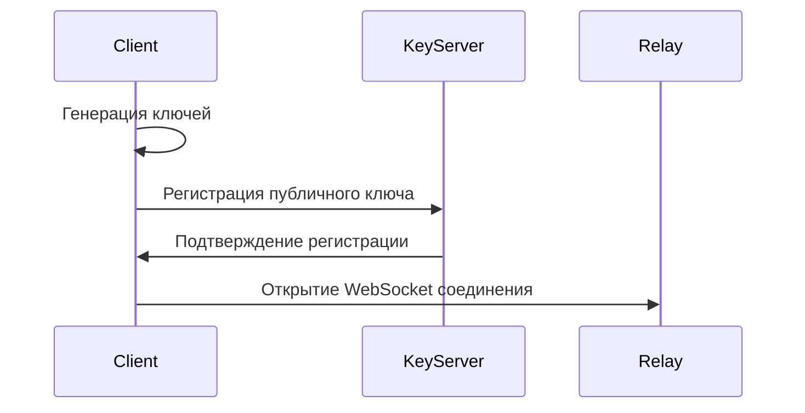
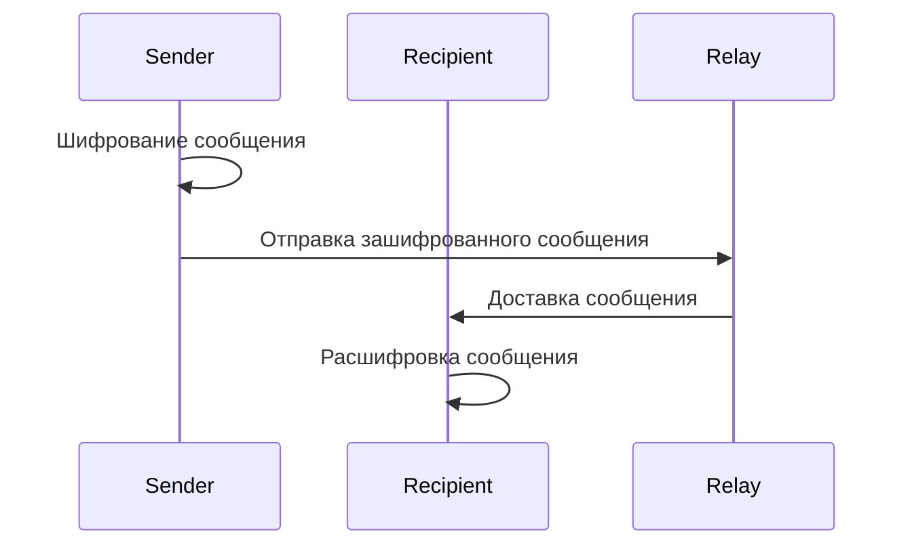
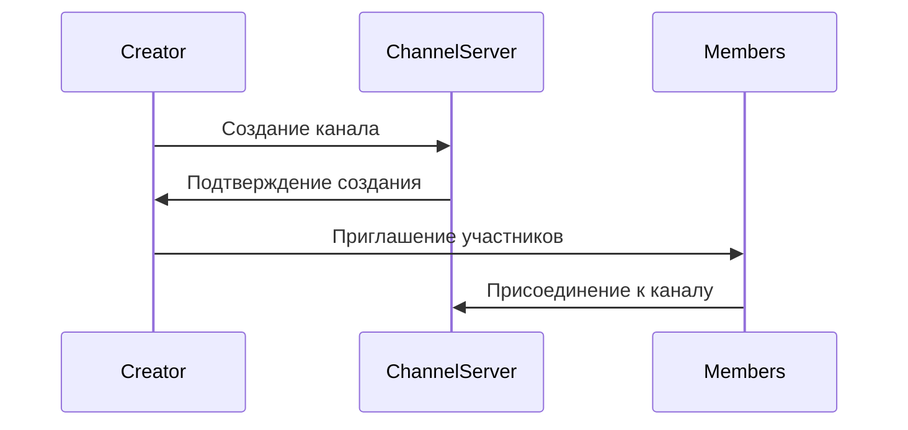

# CipherLink Architecture Documentation

## Общая Архитектура

CipherLink следует принципу **"Dumb Server Architecture"**, где сервер выполняет минимальные функции и не имеет доступа к содержимому сообщений.

### High-Level Architecture Diagram

```
┌─────────────────┐    ┌─────────────────┐    ┌─────────────────┐
│   Web Client    │    │ Mobile Client   │    │ Desktop Client  │
│   (React)       │    │ (React Native)  │    │ (Tauri)         │
└─────────┬───────┘    └─────────┬───────┘    └─────────┬───────┘
          │                      │                      │
          └──────────────────────┼──────────────────────┘
                                 │
                    ┌────────────▼────────────┐
                    │    Load Balancer        │
                    └────────────┬────────────┘
                                 │
        ┌────────────────────────┼────────────────────────┐
        │                        │                        │
┌───────▼────────┐    ┌─────────▼─────────┐    ┌─────────▼─────────┐
│  Relay Server  │    │   Key Server      │    │  Storage Server   │
│ (Message       │    │ (Public Keys)     │    │ (File Storage)    │
│  Routing)      │    │                   │    │                   │
└────────────────┘    └───────────────────┘    └───────────────────┘
```

## Компоненты Системы

### 1. Клиентские Приложения

#### Web Client (React + TypeScript)
- **Расположение**: `/client/web/`
- **Основные функции**:
  - Управление идентичностью
  - Шифрование/дешифрование сообщений
  - Интерфейс чатов, каналов, магазинов
  - Управление контактами

#### Mobile Clients (React Native)
- **Расположение**: `/client/mobile/`
- **Платформы**: Android, iOS
- **Функции**: Полная функциональность веб-версии

#### Desktop Client (Tauri)
- **Расположение**: `/client/desktop/`
- **Платформы**: Windows, macOS, Linux
- **Преимущества**: Лучшая производительность, системные интеграции

### 2. Серверные Компоненты

#### Relay Server
```typescript
// Основные функции:
- Маршрутизация зашифрованных сообщений
- Управление WebSocket соединениями
- Хранение офлайн-сообщений
- Rate limiting и защита от DoS
```

#### Key Server
```typescript
// Основные функции:
- Хранение публичных ключей пользователей
- Верификация цифровых подписей
- Управление списками доверенных ключей
- Предотвращение подделки идентичностей
```

#### Storage Server
```typescript
// Основные функции:
- Временное хранение медиафайлов
- Автоматическое удаление по истечении срока
- Шифрование файлов на стороне клиента
- CDN интеграция для доставки
```

#### Admin Panel
- **Расположение**: `/server/admin-panel/`
- **Функции**: Мониторинг, управление пользователями, настройки

### 3. Криптографический Слой

#### Identity Management
```typescript
interface CipherLinkIdentity {
  uid: string;                    // Уникальный идентификатор
  identityKey: IdentityKeyPair;   // Долгосрочные ключи
  registrationId: number;         // ID регистрации
  preKeys: PreKey[];             // Одноразовые ключи
  signedPreKey: SignedPreKey;    // Подписанный ключ
  seedPhrase: string;            // 12-словная фраза восстановления
}
```

#### Message Encryption Flow
```
1. Отправитель: Шифрует сообщение с использованием ключа получателя
2. Отправитель: Отправляет зашифрованное сообщение на Relay Server
3. Relay Server: Перенаправляет сообщение получателю
4. Получатель: Расшифровывает сообщение своим приватным ключом
```

## Протоколы Безопасности

### Signal Protocol Implementation
- **Double Ratchet Algorithm** для Perfect Forward Secrecy
- **X3DH Key Agreement** для установления сессий
- **Axolotl Ratchet** для синхронизации ключей

### Transport Security
- **TLS 1.3** с Certificate Pinning
- **WebSocket Secure (WSS)** для реального времени
- **HTTP/2** для REST API

### Metadata Protection
- Отсутствие логирования IP-адресов
- Случайные временные задержки сообщений
- Постоянный фоновый трафик (traffic padding)
- Использование onion routing через Tor

## Data Flow Examples

### User Registration Flow


### Message Sending Flow


### Channel Creation Flow


## Scalability Architecture

### Horizontal Scaling
- **Load Balancer**: Распределение нагрузки между серверами
- **Microservices**: Разделение функциональности на сервисы
- **Database Sharding**: Горизонтальное разделение данных
- **CDN Integration**: Глобальная доставка контента

### Performance Optimization
- **Connection Pooling**: Переиспользование соединений
- **Message Batching**: Группировка сообщений
- **Lazy Loading**: Загрузка данных по требованию
- **Caching Layers**: Redis для часто используемых данных

## Deployment Architecture

### Production Environment
```
Internet
    ↓
Cloudflare CDN
    ↓
Load Balancer (Nginx)
    ↓
┌─────────────────────────────────────┐
│           Server Cluster            │
├───────────┬───────────┬─────────────┤
│ Relay     │ Key       │ Storage     │
│ Servers   │ Servers   │ Servers     │
├───────────┼───────────┼─────────────┤
│ PostgreSQL│ Redis     │ MinIO       │
│ (Primary) │ (Cache)   │ (Storage)   │
└───────────┴───────────┴─────────────┘
```

### Development Environment
- **Docker Compose** для локальной разработки
- **Hot Reloading** для быстрой итерации
- **Mock Services** для тестирования
- **Local Database** для разработки

## Monitoring and Observability

### Metrics Collection
- **Prometheus** для сбора метрик
- **Grafana** для визуализации
- **ELK Stack** для логирования
- **Health Checks** для мониторинга состояния

### Alerting System
- **Critical Alerts**: Серверные ошибки, downtime
- **Warning Alerts**: Высокая нагрузка, медленные запросы
- **Info Alerts**: Новые регистрации, активность пользователей

## Security Considerations

### Threat Model
- **Passive Attacks**: Перехват трафика
- **Active Attacks**: Подделка сообщений
- **Side-channel Attacks**: Анализ трафика
- **Social Engineering**: Манипуляции с пользователями

### Mitigation Strategies
- **End-to-End Encryption**: Защита содержимого
- **Forward Secrecy**: Защита прошлых сообщений
- **Traffic Analysis Resistance**: Скрытие паттернов
- **Multi-factor Authentication**: Защита аккаунтов

## Future Enhancements

### Planned Features
- **Voice/Video Calls**: WebRTC интеграция
- **File Sharing**: Расширенные возможности обмена
- **Bot Platform**: API для создания ботов
- **Cross-platform Sync**: Синхронизация между устройствами

### Technical Improvements
- **Quantum-resistant Cryptography**: Подготовка к постквантовой эпохе
- **Decentralized Storage**: IPFS интеграция
- **Advanced Metadata Protection**: Улучшенная анонимность
- **Machine Learning**: Умная модерация контента